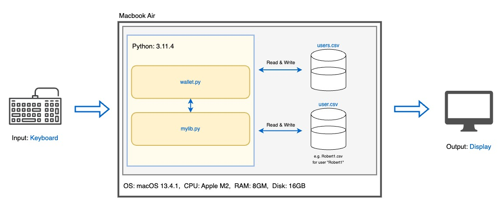

# Crypto Wallet

  
<sub>"Cryptocurrency" by James Ward, *https://dribbble.com/shots/4822394-Cryptocurrency*</sub>

# Criteria A: Planning

## Problem definition
Ms. Sato is a local trader who is interested in the emerging market of cryptocurrencies. She has started to buy and sell electronic currencies, however at the moment she is tracking all her transaction using a ledger in a spreadsheet which is starting to become burdensome and too disorganized. It is also difficult for Ms. Sato to find past transactions or important statistics about the currency. Ms. Sato is in need of a digital ledger that helps her track the amount of the cryptocurrency, the transactions, along with useful statistics. 

Apart for these requirements, Ms. Sato is open to explore a cryptocurrency selected by the developer.

An example of the data stored is 

| Date | Description | Category | Amount  |
|------|-------------|----------|---------|
| Sep 23 2022 | bought a house | Expenses | 10 BTC |
| Sep 24 2022 | food for house celebration | Food | 0.000001 BTC |

## Proposed Solution
I will design and make a digital ledger for Ms. Sato, a client who is in need of a way to track her cryptocurrency transactions. The digital ledger will be about storing data of transactions and generating/displaying statistics, and is constructed using the software Python in the IDE PyCharm. It will take approximately a month to make and will be evaluated according to the success criteria listed below.

The client has allowed the developer to select a type of cryptocurrency to focus on. Therefore, I picked the currency Dai.

Dai is a cryptocurrency operated by MakerDAO, created in December 2017. Dai aims to bring stability to the cryptocurrency economy as an unbiased, decentralized stablecoin. (“The Maker Protocol: MakerDAO's Multi-Collateral Dai (MCD) System”, makerdao.com, https://makerdao.com/en/whitepaper) 1 Dai is approximately pegged to $1 USD, making it an advantage for users who want to avoid the high volatility of cryptocurrencies such as Bitcoin, or Ethereum. Dai can be generated by depositing collateral assets into Maker Vaults in the Maker Protocol, which creates liquidity for users. Being run by an Decentralized Autonomous Organization, there is no central government. This can be an advantage for users who prefer to trust democratic governance for financial systems. All Dai transactions can also be publicly viewed on the Ethereum blockchain, promoting transparency for the currency. (“What Is DAI Coin and Why Is It Special?”, originstamp.com, https://originstamp.com/blog/what-is-dai-coin-and-why-is-it-special/) Overall, Dai is a cryptocurrency valued for its high stability, freedom, and transparency.

I will be making the digital ledger using Python. First, the readability of Python's due to its simple syntax makes maintenance and updates to the ledger easy, and minimal-cost. The reusability of code in Python would make the creation of new, but similar or improved functions efficient. Secondly, Python’s support of modules, packages, and libraries help simplify complicated functions that can be useful in achieving a desirable ledger for the client. Some examples include datetime to record the date of transactions, csv to store these transactions in a database, pandas to analyze data, and maskpass to hide password inputs in the terminal. (“What is Python? Executive Summary”, python.org, https://www.python.org/doc/essays/blurb/)

## Success Criteria
1. The electronic ledger is a text-based software (Runs in the Terminal). (Pre-determined success criteria)
2. The electronic ledger display the basic description of the cyrptocurrency selected. (Pre-determined success criteria)
3. The electronic ledger allows to enter, withdraw and record transactions. (Pre-determined success criteria)
4. The electronic ledger can display statistics such as profit, total spendings, total earnings, and balance.
5. The electronic ledger organizes transactions based on categories such as "Expenses," "Food," "Clothes," etc.
6. The electronic ledger can display all transactions made in a specified month of a specified year.

Success criterias 1, 2, and 3 are pre-determined success criterias as per the client's request.

Success criteria 4 is relevant to the client's needs, as in the problem definition, it is stated that "Ms. Sato is in need of a digital ledger that helps her track the amount of the cryptocurrency, the transactions, along with useful statistics." I interpreted useful statistics as data such as incomes, expenditures, total gain, and total loss. It is also stated she needs to track the amount of cryptocurrency, therefore the current balance she has is another statistic that should be displayed.

Success criteria 5 is relevant to the client's needs as in the problem definition, an exmple of how the client has been storing data is shared. Currently, the client is storing data on each transaction in the format of date, description, category, and amount. Therefore, to make it easier for the client to adapt to using my application, my digital ledger should be able to categorize the client's transactions into similar sorts of categories.

Success criteria 6 is relevant to the client's needs, as in the problem definition, it is stated that it is "difficult for Ms. Sato to find past transactions." Therefore, a feature that easily locates and display past transactions would be a useful feature for the client. Many people tend to finance their money by month, therefore I chose that the ledger should be able to display all transactions from a specified month in a specified year.

Although a feature that can calculate the rate of Dai to the USD can be useful, it is not as important as other features due to the nature of Dai being soft-pegged to the value of USD. As the difference in the value of 1 Dai and $1 USD is at any time practically negligible, a calculation is barely ever required.       


# Criteria B: Design

## System Diagram

*fig.1* System diagram of proposed solution

## Flow Diagrams


## Record of Tasks
| Task No | Planned Action                     | Planned Outcome                                                                                             | Time estimate (min) | Target completion date | Criterion |
|---------|------------------------------------|-------------------------------------------------------------------------------------------------------------|---------------------|------------------------|-----------|
| 1       | Create system diagram              | To have a clear idea of the hardware and software requirements for the proposed solution                    | 10                  | Sep 13                 | B         |
| 2       | Create a login system              | To have a flow diagram and the code for the login system                                                    | 30                  | Sep 14                 | B, C      |
| 3       | Finalize Success Criteria          | To have a finalized success criteria, where its relevance to the client's needs are justified               | 30                  | Sep 18                 | A         |
| 4       | Create a display menu function     | To have a function that can display a menu of choices the user can make, given the choices                  | 10                  | Sep 22                 | C         |
| 5       | Create a validate choice function  | To have a function that can validate user input of their selected choice in the menu                        | 10                  | Sep 22                 | C         |
| 6       | Create a new user system           | To have a code that allows for new users to be created                                                      | 20                  | Sep 25                 | C         |
| 7       | Create a new transaction function  | To have a function that allows for the user to record a new transaction in their own csv file               | 30                  | Sep 25                 | C         |
| 8       | Display basic statistics           | To have a code that displays basic statistics such as total profit, loss, balance, debt                     | 20                  | Sep 25                 | C         |
| 9       | Display currency description       | To have a code that displays the description of the cryptocurrency selected                                 | 5                   | Sep 27                 | C         |
| 10      | Update new transaction function    | To allow for the user to sort any withdrawal (expenditure) transaction into a chosen category               | 20                  | Sep 27                 | C         |
| 11      | Create a obtain data function      | To have a function that obtains transaction data from the user's csv file for use                           | 40                  | Sep 28                 | C         |
| 12      | Create a display chart function    | To have a function that displays a basic bar graph of a specified category of data                          | 30                  | Sep 28                 | C         |
| 13      | Create a loop for wallet functions | To make it so that the program does not exit, and can repeat functions specified by user until they log-out | 15                  | Sep 29                 | C         |
| 14      | Receive peer feedback              | To have received peer feedback and identify issues/improvements that could be made                          | 70                  | Sep 29                 | B, C      |
| 15      | Finalize code                      | Addressed all tasks identified in peer feedback session                                                     | 240                 | Sep 30                 | C         |
| 15      | Repeat all tests                   | To have confirmed that the program passes all tests recorded in the Test Plan                               | 30                  | Oct 1                  | B         |
| 16      | Write documentation                | To have flow diagrams of functions in the program, and have documented these in the README file             | 300                 | Oct 4                  | B, C      |

## Test Plan
| Test Type | Test Content                                       | Description                                  | Input                                                                                                                             | Expected Output                                                                                                                                                                                                                  | Complete? |
|-----------|----------------------------------------------------|----------------------------------------------|-----------------------------------------------------------------------------------------------------------------------------------|----------------------------------------------------------------------------------------------------------------------------------------------------------------------------------------------------------------------------------|-----------|
| Unit      | Create User                                        |                                              | Run the program Select 2 at startup menu Input "Robert1" and "passw0rd"                                                           | last line in users.csv is "Robert,passw0rd" a new csv file of the name Robert.csv is created first line in Robert1.csv is "(date),0,other"                                                                                       | Y         |
| Unit      | Log-in                                             |                                              | After above, input "Robert1" and "passw0rd"                                                                                       | "[Welcome to your wallet]" should be printed, followed by the main menu                                                                                                                                                          | Y         |
| Unit      | Create New Deposit                                 |                                              | After above, select 1 at main menu Select 1 at transaction menu Input "123.45"                                                    | The most recent line in the Robert1.csv file should be "(date),123.45,deposit"                                                                                                                                                   | Y         |
| Unit      | Create New Withdrawal                              |                                              | After above, select 1 at return menu Select 1 at main menu Select 2 at transaction menu Input "23.45" Select 5 at categories menu | The most recent line in the Robert1.csv file should be "(date),-23.45,other"                                                                                                                                                     |           |
| Unit      | View Past Transactions                             |                                              | After above, select 1 at return menu Select 2 at main menu Input 2023 for year, (the month of testing) for month                  | The terminal should display: [All Transactions from 2023/(month)] [Date, Amount, Category] ['(date)', '0', 'other'] ['(date)', '123.45', 'deposit'] ['(date)', '-23.45', 'other']                                                | Y         |
| Unit      | View User Statistics page 1                        |                                              | After above, select 1 at return menu Select 3 at main menu                                                                        | The terminal should display the first page of statistics: User creation date, current balance, debt state Total profit, total loss, profit/loss ratio Bar graph to total profit and loss Menu to ask to go to next page, or exit | Y         |
| Unit      | View User Statistics page 2                        |                                              | After above, select 1 for next page menu Input 2023 for year, (the month of testing) for month                                    | The terminal should display the second page of statistics: Bar graph for profit/loss of the month Bar graph for expenses by category of the month Menu to ask to go to next page, or exit                                        | Y         |
| Unit      | View cryptocurrency description                    |                                              | After above, select 2 for next page menu Select 1 at return menu Select 4 at main menu                                            | The terminal should display a text of description for the DAI currency                                                                                                                                                           | Y         |
| Unit      | Log-out from return? menu                          |                                              | After above, select 2 for return menu                                                                                             | The program should exit with exit code 0.                                                                                                                                                                                        | Y         |
| System    | The above unit tests run continuously              |                                              | -                                                                                                                                 | The program should run from start to finish without producing errors.                                                                                                                                                            | Y         |
| Unit      | Log-in from log-in menu and Log-out from main menu |                                              | Run the program Select 1 at startup menu Input Robert1 and passw0rd Select 5 at main menu                                         | "[Welcome to your wallet]" should be printed, followed by the main menu When 5 is selected, the code should exit with exit code 1.                                                                                               | Y         |
| Usability | General ease and clarity of use                    | Let a randomly selected peer use the program | -                                                                                                                                 | Program should not produce any errors. Ideally, the tester does not have to ask anything for clarification.                                                                                                                      |           |


# Criteria C: Development
## Create New User Option
My client requires a log-in system (password protection) to keep their confidential data safe, and I thought of creating a way for users to create a unique username and password which they can use to log-in and obtain the same data for next use. Being able to host multiple users instead of just one on the application, would be beneficial if the client has family members, or would like to split her records between for example personal spendings, and expenses from their workplace.

In the first line, I define the function create_user. It does not take any parameters.

```.py
with open('users.csv', mode='r') as users_list:
    users_database = users_list.readlines()
new_name = input("Create a username: ")
if users_database:
    validate = True
    while validate == True:
        for user in users_database:
            if new_name in user:
                new_name = input("Username already taken. Please enter another username: ")
            else:
                validate = False
new_pass = input("Create a password: ")
confirm_new_pass = input("Confirm new password: ")
validate = True
while validate == True:
    if confirm_new_pass != new_pass:
        new_pass = input("Passwords do not match. Create a password: ")
        confirm_new_pass = input("Confirm new password: ")
    else:
        validate = False
with open('users.csv', mode='a') as users_list:
    writer = csv.writer(users_list)
    writer.writerow([new_name, new_pass])
with open(f"{new_name}.csv", mode='a') as user_data:
    writer = csv.writer(user_data)
    writer.writerow([datetime.date.today(), 0, "other"])
```

## Login System
My client requires a system to protect the private data. I thought about using a login system to accomplish this requirement using a if condition and the open command to work with a csv file.

In the first line, I define the function try_login. The try_login function takes two parameters. name, which is a string, and password, which is also a string. The function should have a boolean output representing True if the user logs in correctly, and False if they do not.

From the second line to the third line, I save the user information which is stored in a csv file as a variable called data. The user.csv file contains user log-in data as comma separated values (username),(password). The open function takes two parameters. First, the csv file for the function to open, and second, the mode of what the function will do with the csv file. The mode 'r' tells the program to read the content of the csv file opened. The line 'as f' saves the file as the variable f, making it easier call other functions with the csv file later. Using the function readlines(), the program saves each line of the file f as an item in the list 'data'.

From the fourth line to the final line, the program will use the data obtained in the previous lines to determine if the user may now log-in to the ledger or not. First, the variable success, a boolean which represents whether the user has successfully logged in or not, is defined. When first defined, success is False. In the next line, a for loop is started, which will loop between every line (item in lsit, string) in data (list). For ever line, the program splits the line by ',' and stores the 0 index value as the uname variable, and the 1 index value as the upass variable. (The upass variable needs the strip() function, as it is the end of a line in the csv file, and hence '\n' representing the start of a new line is at the end of the string. The strip() function removes the '\n'.)

In the next line, the program checks for two comparisons: if uname defined above is equal to the argument provided for the name parameter, and if upass defined above is equal to the argument provided for the password parameter. When both of these comparisons are True, the program inside the if statement will run. When True, the success variable becomes True, and the loop is broken. Else, the for loop will keep repeating the steps inside.

Once the loop has gone through all lines in data (the csv file), or the if statement is True and the loop has been broken, the function finishes and returns the variable success.
```.py
def try_login(name: str, password: str) -> bool:
    with open('users.csv', mode='r') as f:
        data = f.readlines()

    success = False
    for line in data:
        uname = line.split(',')[0]
        upass = line.split(',')[1].strip()  # strip() removes \n for any string unless specified

        if uname == name and upass == password:
            success = True
            break

    return success
```

## Creating a New User
