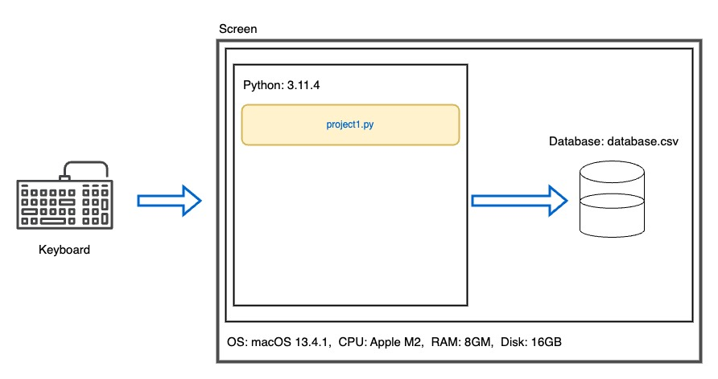

# Crypto Wallet

  
<sub>Illustration for Glenn Harvey</sub>

# Criteria A: Planning

## Problem definition

Ms. Sato is a local trader who is interested in the emerging market of cryptocurrencies. She has started to buy and sell electronic currencies, however at the moment she is tracking all his transaction using a ledger in a spreadsheet which is starting to become burdensome and too disorganized. It is also difficult for Ms Sato to find past transactions or important statistics about the currency. Ms Sato is in need of a digital ledger that helps her track the amount of the cryptocurrency, the transactions, along with useful statistics. 

Apart for this requirements, Ms Sato is open to explore a cryptocurrency selected by the developer.

An example of the data stored is 

| Date | Description | Category | Amount  |
|------|-------------|----------|---------|
| Sep 23 2022 | bought a house | Expenses | 10 BTC |
| Sep 24 2022 | food for house celebration | Food | 0.000001 BTC |


## Proposed Solution

Design statement:
I will to design and make a ———— for a client who is ———. The ——– will about ———— and is constructed using the software ———. It will take  ———- to make and will be evaluated according to the criteria ———.

** add a description of your coin and citation **

Justify the tools/structure of your solution

## Success Criteria
1. The electronic ledger is a text-based software (Runs in the Terminal).
2. The electronic ledger display the basic description of the cyrptocurrency selected.
3. The electronic ledger allows to enter, withdraw and record transactions.
4. The electronic ledger can display statistics such as profit, total spendings, total earnings, and total balance.
5. The electronic ledger is password protected.
6. The electronic ledger 

# Criteria B: Design

## System Diagram

*fig.1* System diagram of proposed solution
## Flow Diagrams


## Record of Tasks
| Task No | Planned Action        | Planned Outcome                                                                          | Time estimate | Target completion date | Criterion |
|---------|-----------------------|------------------------------------------------------------------------------------------|---------------|------------------------|-----------|
| 1       | Create system diagram | To have a clear idea of the hardware and software requirements for the proposed solution | 10 min        | Sep 13                 | B         |
| 2       | Create a login system | To have a flow diagram and the code for the login system                                 | 30 min        | Sep 14                 | B, C      |

# Criteria C: Development

## Login System
My client requires a system to protect the private data. I thought about using a login system to accomplish this requirement using a if condition and the open command to work with a csv file.

In the first line, I define the function try_login. The try_login function takes two parameters. name, which is a string, and password, which is also a string. The function will have a boolean output representing True if the user logs in correctly, and False if they do not. This is saved in the variable success.

From the second line to the third line, I save the user information which is stored in a csv file as a variable called data. The open function takes two parameters. First, the csv file for the function to open, and second, the mode of what the function will do with the csv file. The mode 'r' tells the program to read the content of the csv file opened.
```.py
def try_login(name: str, password: str) -> bool:
    with open('users.csv', mode='r') as f:
        data = f.readlines()

    success = False
    for line in data:
        uname = line.split(',')[0]
        upass = line.split(',')[1].strip()  # strip() removes \n for any string unless specified

        if uname == name and upass == password:
            success = True
            break

    return success
```
